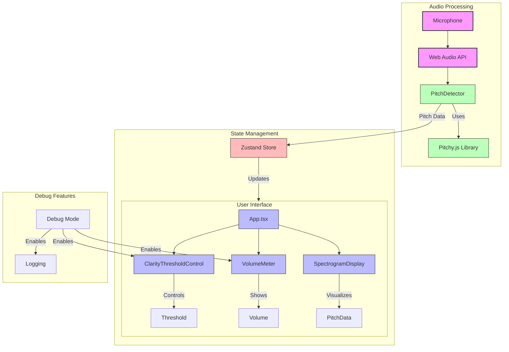

# Vocal Smash

Get fast, visual, useful feedback on hitting your notes with Vocal Smash!

Vocal Smash is a nifty singing app for serious singers and vocalists! It provides real-time pitch detection and visualization to help you improve your singing accuracy.

## Architecture



## Features

- **Real-time Pitch Detection**: Sub-100ms latency for instant feedback
- **Visual Feedback**: Beautiful, intuitive display of your current note and pitch accuracy
- **Progressive Web App**: Install and use on any device with a browser
- **Offline Support**: Practice anywhere, even without an internet connection
- **Modern UI**: Smooth animations and responsive design
- **Cross-Platform**: Works on desktop and mobile browsers

## Project Structure

```
vocal-smash/
├── src/
│   ├── audio/           # Audio processing and pitch detection
│   ├── ui/             # React components and hooks
│   │   ├── components/
│   │   ├── hooks/
│   │   └── store/
│   └── pwa/            # PWA configuration and service worker
├── tests/
│   ├── unit/          # Unit tests
│   ├── integration/   # Integration tests
│   └── e2e/           # End-to-end tests with Playwright
└── public/
    └── icons/         # App icons for PWA
```

## Getting Started

### Prerequisites
- Node.js (v18 or higher recommended)
- npm (v9 or higher)

### Local Development Setup

1. Clone the repository:
```bash
git clone https://github.com/yourusername/vocal-smash.git
cd vocal-smash
```

2. Install dependencies:
```bash
npm install
```

3. Start the development server:
```bash
npm run dev
```

The application will be available at `http://localhost:5173`

### Building for Production

```bash
npm run build
```

The production build will be available in the `dist` directory.

### Running Tests

```bash
# Run unit tests
npm test

# Run tests in watch mode
npm run test:watch

# Run tests with coverage
npm run test:coverage

# Run end-to-end tests
npm run test:e2e
```

## Technical Details

- Built with React, TypeScript, and Vite
- Uses Web Audio API for real-time audio processing
- Uses Pitchy.js for accurate pitch detection
- Styled with Tailwind CSS
- Animations powered by Framer Motion
- State management with Zustand
- PWA support with Workbox
- Testing with Jest and Playwright

## Contributing

Contributions are welcome! Please read our contributing guidelines before submitting pull requests.

## License

This project is licensed under the MIT License - see the LICENSE file for details.

## Acknowledgments

- Built with ❤️ for singers
- Based on scientific research in the book Peak about deliberate practice and instant feedback
- Special thanks to the Web Audio API and React communities
